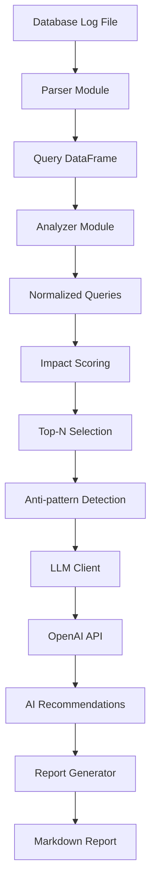

# 🏗️ Architecture Documentation

## Table of Contents

- [System Overview](#system-overview)
- [Core Components](#core-components)
- [Data Flow](#data-flow)
- [Module Architecture](#module-architecture)
- [Design Patterns](#design-patterns)
- [Configuration System](#configuration-system)
- [Error Handling](#error-handling)
- [Performance Considerations](#performance-considerations)
- [Extension Points](#extension-points)
- [Testing Strategy](#testing-strategy)
- [Dependencies](#dependencies)

## System Overview

Slow Query Doctor is a modular Python application that analyzes database slow query logs and provides AI-powered optimization recommendations. Currently focused on PostgreSQL with multi-database support planned for v0.4.0. The system follows a **pipeline architecture** with clear separation of concerns:

```
Log Files → Parser → Analyzer → AI Client → Report Generator → Markdown Report
```

### Core Philosophy

- **Modularity**: Each component has a single responsibility
- **Extensibility**: Easy to add new log formats, analysis methods, or output formats  
- **Configuration-driven**: Behavior controlled via config files and environment variables
- **AI-first**: Leverages OpenAI GPT models for intelligent recommendations
- **Developer-friendly**: Comprehensive logging, error handling, and debugging support

## Core Components

### 1. Parser Module (`parser.py`)

**Purpose**: Extracts slow query information from database log files (currently PostgreSQL)

**Key Features**:
- Multi-format support (plain text, CSV, JSON)
- Multi-line query parsing with regex
- Configuration file loading
- Progress tracking with tqdm
- Robust error handling for malformed logs

**Architecture**:
```python
def parse_postgres_log(log_file_path: str, log_format: str = "plain") -> pd.DataFrame
```

**Design Decisions**:
- Returns pandas DataFrame for efficient data manipulation
- Uses regex for flexible log parsing
- Handles multiple log formats through format parameter
- Graceful degradation for malformed entries

### 2. Analyzer Module (`analyzer.py`)

**Purpose**: Processes parsed queries and calculates performance metrics

**Key Classes**:
- `SlowQuery`: Data class representing a slow query with metadata
- `run_slow_query_analysis()`: Main analysis orchestrator

**Core Algorithms**:
- **Query Normalization**: Removes literals for grouping similar queries
- **Impact Scoring**: `duration × frequency` for prioritization
- **Statistical Analysis**: Min, max, average durations per query pattern
- **Anti-pattern Detection**: Integration with static analysis

**Architecture**:
```python
@dataclass
class SlowQuery:
    raw_query: str
    normalized_query: str
    duration: float
    timestamp: str
    # ... metadata fields
```

### 3. LLM Client Module (`llm_client.py`)

**Purpose**: Interfaces with configurable AI providers for intelligent recommendations

**Key Classes**:
- `LLMConfig`: Configuration data class with provider selection
- `LLMClient`: Main API client with batch processing
- `AIProvider`: Enum for supported providers (OpenAI, Ollama, future: Claude, Gemini)

**Features**:
- **Configurable AI providers** (Ollama default, OpenAI optional)
- **Custom endpoints** and model configuration
- Batch recommendation generation
- Timeout and error handling
- Environment variable integration
- **Privacy-first defaults** (local Ollama)

**Architecture**:
```python
class LLMClient:
    def __init__(self, provider: AIProvider = AIProvider.OLLAMA)
    def batch_generate_recommendations(self, queries: List[Dict]) -> List[str]
```

### 4. Report Generator Module (`report_generator.py`)

**Purpose**: Creates comprehensive Markdown reports

**Features**:
- Template-based report generation
- Integration with AI recommendations
- Statistical summaries
- Query formatting and syntax highlighting
- Configurable output directories

### 5. Anti-patterns Module (`antipatterns.py`)

**Purpose**: Static analysis for common SQL performance issues

**Key Classes**:
- `AntiPatternType`: Enumeration of detectable patterns
- `AntiPatternMatch`: Represents detected issues
- `AntiPatternDetector`: Main detection engine
- `StaticQueryRewriter`: Suggests query improvements

**Detected Patterns**:
- Leading wildcard LIKE queries (`LIKE '%text'`)
- Functions on indexed columns (`WHERE UPPER(name) = 'VALUE'`)
- Large IN clauses
- NOT IN with subqueries
- JOINs without WHERE clauses

## Data Flow

### 1. Input Processing
```
PostgreSQL Log File → Parser → DataFrame[timestamp, duration_ms, query]
```

### 2. Analysis Pipeline
```
Raw Queries → Normalization → Grouping → Impact Calculation → Top-N Selection
```

### 3. AI Enhancement
```
Top Queries → Batch API Calls → OpenAI GPT → Optimization Recommendations
```

### 4. Report Generation
```
Analysis Results + AI Recommendations → Template Engine → Markdown Report
```

### Complete Flow Diagram



## Module Architecture

### Package Structure
```
slowquerydoctor/
├── __init__.py          # Public API exports
├── __main__.py          # CLI entry point
├── main.py              # CLI argument parsing & orchestration
├── parser.py            # Log file processing
├── analyzer.py          # Query analysis & scoring
├── llm_client.py        # OpenAI API integration
├── report_generator.py  # Report creation
└── antipatterns.py      # Static analysis
```

### Dependency Graph
```
main.py
├── parser.py (pandas, yaml, tqdm)
├── analyzer.py (pandas, antipatterns)
├── llm_client.py (openai)
└── report_generator.py (llm_client, analyzer)
```

### Interface Design

Each module exports a clean, minimal API:

```python
# Parser
parse_postgres_log(log_file_path: str, log_format: str = "plain") -> pd.DataFrame

# Analyzer  
run_slow_query_analysis(df: pd.DataFrame, top_n: int = 5) -> Tuple[pd.DataFrame, Dict]
normalize_query(query: str) -> str

# LLM Client
LLMClient.batch_generate_recommendations(queries: List[Dict]) -> List[str]

# Report Generator
ReportGenerator.generate_markdown_report(top_queries, summary, recommendations) -> str
```

## Design Patterns

### 1. **Configuration Pattern**
- Centralized config via `LLMConfig` dataclass
- Environment variable fallbacks
- YAML file support in parser

### 2. **Template Method Pattern** 
- `ReportGenerator` uses template-based report generation
- Extensible for different output formats

### 3. **Strategy Pattern**
- Multiple log format parsers (plain, CSV, JSON)
- Pluggable anti-pattern detectors

### 4. **Data Transfer Object Pattern**
- `SlowQuery` and `LLMConfig` as data containers
- Clean data passing between modules

### 5. **Facade Pattern**
- Main CLI provides simple interface to complex analysis pipeline
- Public API in `__init__.py` hides implementation details

## Configuration System

### Environment Variables
```bash
# AI Provider Configuration (v0.2.0+)
AI_PROVIDER        # Provider selection (default: ollama)
AI_BASE_URL        # Custom endpoint for any provider
AI_MODEL           # Model selection (provider-specific)
AI_API_KEY         # API key (if required by provider)

# Legacy OpenAI (v0.1.x compatibility)
OPENAI_API_KEY     # OpenAI API key
OPENAI_MODEL       # Model selection (default: gpt-4o-mini)  
OPENAI_BASE_URL    # Custom OpenAI endpoint
```

### Configuration File (`.slowquerydoctor.yml`)
```yaml
# Parser settings
log_format: "plain"
min_duration_ms: 1000

# Analysis settings  
top_n: 10
impact_threshold: 0.8

# AI Provider settings (v0.2.0+)
ai_provider: "ollama"        # ollama (default), openai
ai_base_url: "http://localhost:11434"  # Custom endpoint
ai_model: "llama2"           # Provider-specific model
ai_max_tokens: 200
ai_temperature: 0.3

# Legacy OpenAI settings (v0.1.x compatibility)
openai_model: "gpt-4o-mini"
openai_max_tokens: 200

# Output settings
output_dir: "reports"
include_antipatterns: true
```

### CLI Arguments
```bash
--output           # Report output path
--top-n           # Number of queries to analyze
--min-duration    # Minimum duration threshold
--verbose         # Debug logging
```

## Error Handling

### Strategy
- **Graceful degradation**: Continue analysis even with partial failures
- **Detailed logging**: Comprehensive error context for debugging
- **User-friendly messages**: Clear guidance for common issues

### Error Categories

1. **File Errors**
   - Missing log files → FileNotFoundError with helpful message
   - Permission issues → Guidance on file access

2. **Parsing Errors**
   - Malformed logs → Warning + continue with valid entries
   - Unsupported formats → Clear format requirements

3. **API Errors**  
   - Missing API keys → Configuration guidance
   - Rate limiting → Retry logic with backoff
   - Network issues → Timeout handling

4. **Analysis Errors**
   - No slow queries found → Check PostgreSQL configuration
   - Empty datasets → Validation with helpful suggestions

## Performance Considerations

### Memory Management
- **Streaming parser**: Process large log files without loading entirely into memory
- **Pandas optimization**: Efficient DataFrame operations
- **Batch processing**: Group AI API calls to reduce overhead

### Scalability
- **Progress tracking**: tqdm progress bars for long-running operations  
- **Configurable limits**: `top_n` parameter prevents excessive analysis
- **Efficient algorithms**: O(n) normalization, O(n log n) sorting

### Caching Opportunities
- **Query normalization**: Cache normalized patterns
- **AI responses**: Cache recommendations for similar queries
- **Configuration**: Load config files once per run

## Extension Points

### 1. New Database Support (v0.4.0)
Add support for MySQL/SQL Server in `parse_database_log()`:
```python
if database_type == "mysql":
    return parse_mysql_log(log_file_path)
elif database_type == "sqlserver":
    return parse_sqlserver_log(log_file_path)
```

### 2. Additional Anti-patterns
Extend `AntiPatternType` enum and add detector methods:
```python
def detect_your_pattern(self, query: str) -> List[AntiPatternMatch]:
    # Implementation
```

### 3. Additional AI Providers

#### How to Add a New AI Provider

**Step 1**: Extend the `AIProvider` enum in `llm_client.py`:
```python
class AIProvider(Enum):
    OLLAMA = "ollama"
    OPENAI = "openai"
    CLAUDE = "claude"      # Your new provider
    GEMINI = "gemini"      # Another provider
    CUSTOM = "custom"      # For private endpoints
```

**Step 2**: Create provider-specific client class:
```python
class ClaudeLLMClient(LLMClient):
    """Claude AI provider implementation"""
    
    def __init__(self, config: LLMConfig):
        super().__init__(config)
        # Claude-specific initialization
        self.client = anthropic.Anthropic(api_key=config.api_key)
    
    def batch_generate_recommendations(self, queries: List[Dict]) -> List[str]:
        """Generate recommendations using Claude API"""
        recommendations = []
        for query_info in queries:
            try:
                response = self.client.messages.create(
                    model=self.config.model or "claude-3-sonnet-20240229",
                    max_tokens=self.config.max_tokens,
                    temperature=self.config.temperature,
                    messages=[{
                        "role": "user", 
                        "content": self._build_prompt(query_info)
                    }]
                )
                recommendations.append(response.content[0].text)
            except Exception as e:
                logger.error(f"Claude API error: {e}")
                recommendations.append("Error generating recommendation")
        return recommendations
    
    def _build_prompt(self, query_info: Dict) -> str:
        """Build Claude-specific prompt format"""
        return f"""Analyze this slow SQL query and provide optimization recommendations:
        
Query: {query_info['query_text']}
Duration: {query_info['avg_duration']}ms
Frequency: {query_info['frequency']} times

Provide specific, actionable optimization suggestions."""
```

**Step 3**: Update the factory method in `LLMClient`:
```python
@classmethod
def create_client(cls, provider: AIProvider, config: LLMConfig) -> 'LLMClient':
    """Factory method to create provider-specific clients"""
    if provider == AIProvider.OPENAI:
        return OpenAILLMClient(config)
    elif provider == AIProvider.OLLAMA:
        return OllamaLLMClient(config)
    elif provider == AIProvider.CLAUDE:
        return ClaudeLLMClient(config)
    elif provider == AIProvider.GEMINI:
        return GeminiLLMClient(config)
    else:
        raise ValueError(f"Unsupported AI provider: {provider}")
```

**Step 4**: Add configuration support:
```yaml
# .slowquerydoctor.yml
ai_provider: "claude"
ai_base_url: "https://api.anthropic.com"
ai_model: "claude-3-sonnet-20240229"
ai_api_key: "${CLAUDE_API_KEY}"
ai_max_tokens: 300
ai_temperature: 0.3
```

**Step 5**: Add environment variable support:
```bash
# Environment variables
AI_PROVIDER=claude
CLAUDE_API_KEY=your-claude-api-key
AI_MODEL=claude-3-sonnet-20240229
```

#### Provider Implementation Checklist

When adding a new provider, ensure:

- [ ] **Error Handling**: Robust exception handling for API failures
- [ ] **Rate Limiting**: Implement backoff and retry logic
- [ ] **Model Configuration**: Support provider-specific model names
- [ ] **Authentication**: Handle API keys, tokens, or custom auth
- [ ] **Prompt Engineering**: Optimize prompts for the specific model
- [ ] **Response Parsing**: Handle provider-specific response formats  
- [ ] **Timeout Handling**: Configure appropriate request timeouts
- [ ] **Logging**: Add appropriate debug and error logging
- [ ] **Testing**: Unit tests for the new provider integration
- [ ] **Documentation**: Update configuration examples and README

#### Example: Custom Private Endpoint

```python
class CustomLLMClient(LLMClient):
    """For private/enterprise AI endpoints"""
    
    def __init__(self, config: LLMConfig):
        super().__init__(config)
        self.base_url = config.base_url or "https://your-private-ai.company.com"
        self.headers = {
            "Authorization": f"Bearer {config.api_key}",
            "Content-Type": "application/json",
            "X-API-Version": "2024-01"
        }
    
    def batch_generate_recommendations(self, queries: List[Dict]) -> List[str]:
        # Implementation for your custom endpoint
        pass
```

### 4. New Output Formats
Extend `ReportGenerator`:
```python
def generate_json_report(self, ...):
    # JSON output implementation
```

### 5. Advanced Analysis
Add new scoring algorithms in `analyzer.py`:
```python
def calculate_complexity_score(query: str) -> float:
    # Custom scoring logic
```

## Testing Strategy

### Unit Tests
- **Parser**: Mock log files, test format handling
- **Analyzer**: Test normalization, scoring algorithms  
- **LLM Client**: Mock API responses
- **Report Generator**: Validate output format

### Integration Tests
- **End-to-end**: Full pipeline with sample data
- **Error scenarios**: Malformed inputs, API failures
- **Performance**: Large log file handling

### Test Data
- **Sample logs**: Real PostgreSQL log files in `docs/sample_logs/`
- **Edge cases**: Malformed queries, unusual characters
- **Performance data**: Large datasets for scalability testing

## Dependencies

### Core Dependencies
```
openai>=1.0.0          # AI API client
pandas>=2.0.0          # Data analysis
python-dotenv>=0.19.0  # Environment variables  
pyyaml>=6.0.0          # Configuration files
tqdm>=4.0.0            # Progress bars
```

### Development Dependencies
```
pytest>=7.0.0          # Testing framework
pytest-cov>=4.0.0      # Coverage reporting
black>=22.0.0          # Code formatting
flake8>=5.0.0          # Linting
mypy>=1.0.0            # Type checking
```

### Standard Library Usage
- `argparse`: CLI interface
- `logging`: Comprehensive logging
- `pathlib`: Modern path handling
- `re`: Regular expressions for parsing
- `hashlib`: Query fingerprinting
- `dataclasses`: Clean data structures

---

## Release and Tagging Strategy

### Version Tagging Convention

To clearly communicate the development roadmap and feature freeze states:

**v0.1.x Series (Feature Complete)**:
- `v0.1.6-final-feature` - Final release with new features
- `v0.1.7` - Bug fixes only
- `v0.1.8` - Bug fixes only

**v0.2.x Series (Active Development)**:
- `v0.2.0-beta.1` - Early beta with Ollama integration
- `v0.2.0-rc.1` - Release candidate
- `v0.2.0` - Stable release

**Special Tags**:
- `v0.1.6-final-feature` - Explicitly marks the end of v0.1.x feature development
- `v0.2.0-ai-providers` - Major milestone for configurable AI providers
- `v0.4.0-multi-database` - Major milestone for MySQL/SQL Server support

### Release Branch Strategy

```bash
# Feature development branches
feature/v0.2.0-ollama-integration
feature/v0.2.0-explain-plans
feature/v0.2.0-html-reports

# Release branches
release/v0.1.x    # Bug fixes only after v0.1.6
release/v0.2.0    # Active feature development
release/v0.3.0    # Future ML features

# Maintenance
hotfix/v0.1.7-critical-parser-fix
```

This tagging strategy makes it immediately clear to anyone browsing the repository:
- Which releases contain new features vs. bug fixes
- Where the feature development boundary lies
- What major capabilities each release introduced

## Related Documentation

- [README.md](README.md) - Project overview and quick start
- [CONTRIBUTING.md](CONTRIBUTING.md) - Development guidelines  
- [ROADMAP.md](ROADMAP.md) - Future features and improvements
- [TECHNICAL_DEBT.md](TECHNICAL_DEBT.md) - Known limitations
- [docs/configuration.md](docs/configuration.md) - Configuration guide
- [docs/getting-started.md](docs/getting-started.md) - Installation and usage
- [docs/examples.md](docs/examples.md) - Usage examples
- [docs/advanced-features.md](docs/advanced-features.md) - Advanced configuration
- [docs/sample-data.md](docs/sample-data.md) - Sample log files documentation
- [docs/sample_logs/mysql/](docs/sample_logs/mysql/) - Future MySQL sample logs
- [docs/sample_logs/sqlserver/](docs/sample_logs/sqlserver/) - Future SQL Server sample logs

**Made with ❤️ for database performance optimization**